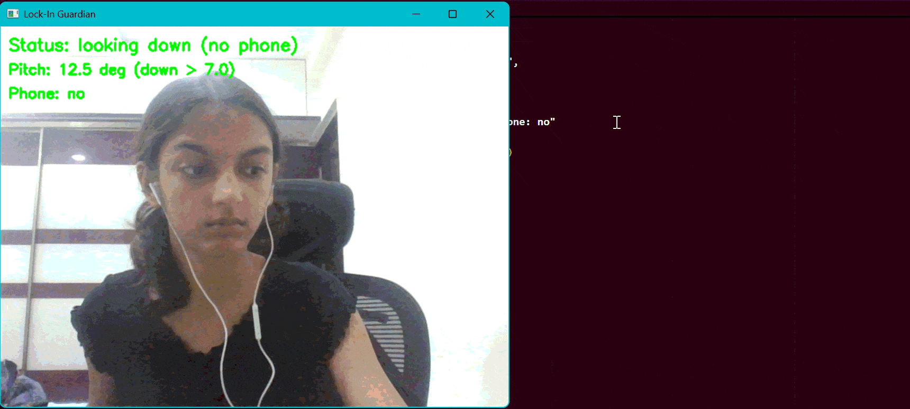

# Lock-In Guardian

A Python productivity tool that uses your webcam to detect when you're looking down at your phone. If it detects doomscrolling for too long, it interrupts you by playing a lockin video of your choice.

## Features
- Face tracking with MediaPipe
- Head pose estimation
- Phone detection using YOLOv8
- Automatic lock-in video playback
- Cooldown system to avoid repeated triggers
- Press q in the webcam window to quit.

## Demo

<p align="center">
  
</p>

## Installation

pip install -r requirements.txt

## Usage

python lockin_guardian.py

## Requirements

- Python 3.10+
- Webcam
- VLC (Windows)

## Pipeline

```
Webcam
   │
   ▼
MediaPipe Face Mesh
   │
Head Pose Estimation
   │
   ├─────────────┐
   ▼             ▼
Looking Down?   YOLOv8 Phone Detection
   │             │
   └──────┬──────┘
          ▼
Continuous Detection
          ▼
Play Lock-In Video
```


## Future Improvements

- GUI
- Better calibration
- Custom warning sounds
- Statistics dashboard
